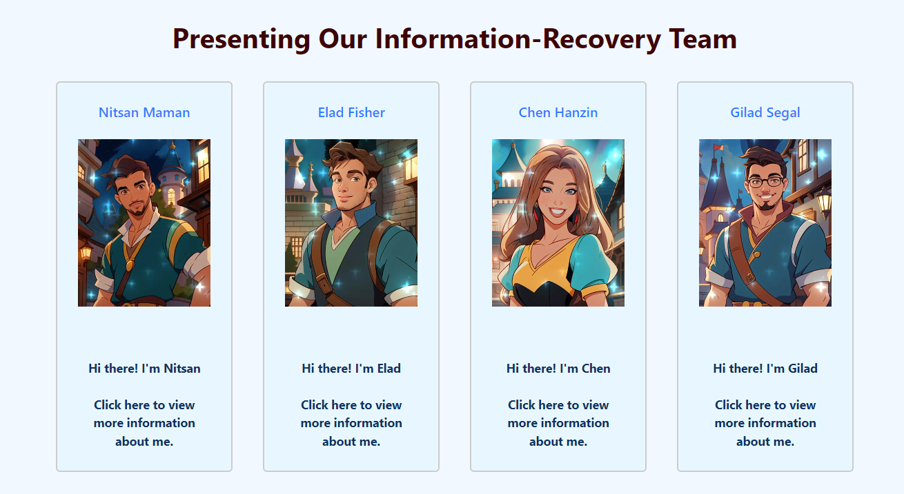

# Information Recovery Project

See Live App [here](https://gilseg10.github.io/Information-recovery-class/main.html)

This project includes html pages (+ css) that describes out team members. Also, There is our first Home Assignment for this class (HW1)

## Main Page
**Presenting Team Members:** this is the main page that provide live images of our team members. Each team member card is a link for more information about the member.

## Students Pages
**Presenting Students Information:** Email, Hobbies and Courses taken this semester.

## HW2
Ground steps for web crawler based on STEAM API. In this task we worked on several queries (appear on the word file) with python files to run them. The quereis are: 

1. Fetching total play time for each game of "own games" from a set of users in Steam. each game then was devided to category of: "Casual", "Intense" or "Competitive" according to average play time.
2. Fetching the most popular words in games achievements.
3. Fetching the most popular words in games descriptions.

All scripts are in /HW2/crawlerFiles with additional script of "SteamIDCollector". This script is meant to collect steam ids and save them in .csv file for user's data described in query 1. 

## HW3
Authorities and Hubs: we answered questions in this subject (.doc file) and added one more python script for our web crawler. This script invloves fetching most popular games from specific categories and calculating pageRank for each page. Also we added python script to demonstare graphical result and small UI for our first query from HW2.  

## Final Project
In /project/final_project_answers.docx there are the course final questions and answers of our group.
